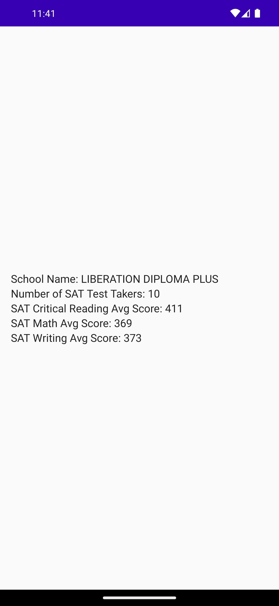

# SATNYC Android App

SATNYC is an Android app that provides information about schools in New York City along with their SAT scores. The app fetches data from a remote API and displays school details, including their SAT scores.

## Features

- Display a list of schools along with basic information.
- View detailed information about a selected school, including SAT scores.

## Screenshots

 

## Tech Stack

- Kotlin: A modern programming language for Android app development.
- Android Architecture Components: ViewModel and LiveData for managing UI-related data.
- Retrofit: A type-safe HTTP client for making API requests.
- Hilt: A dependency injection library for Android apps.
- Compose: A modern UI toolkit for building native user interfaces.
- JUnit and Mockito: Libraries for unit testing.

## Getting Started

1. Unzip the folder
2. Open the project in Android Studio.
3. Build and run the app on an emulator or physical device.

## Project Structure

- `app`: The main Android application module.
    - `src/main`: Main application code and resources.
    - `src/test`: Unit tests for the app module.
- `data`: Data-related classes including data models and repository.
- `ui`: User interface components and screens.
- `viewmodel`: ViewModels for managing UI-related data.
- `di`: for dependency injection.

## Testing

The project includes unit tests for the ViewModel using JUnit and Mockito. To run the tests, navigate to the `app/src/test` directory and run the tests using Android Studio's testing tools.

